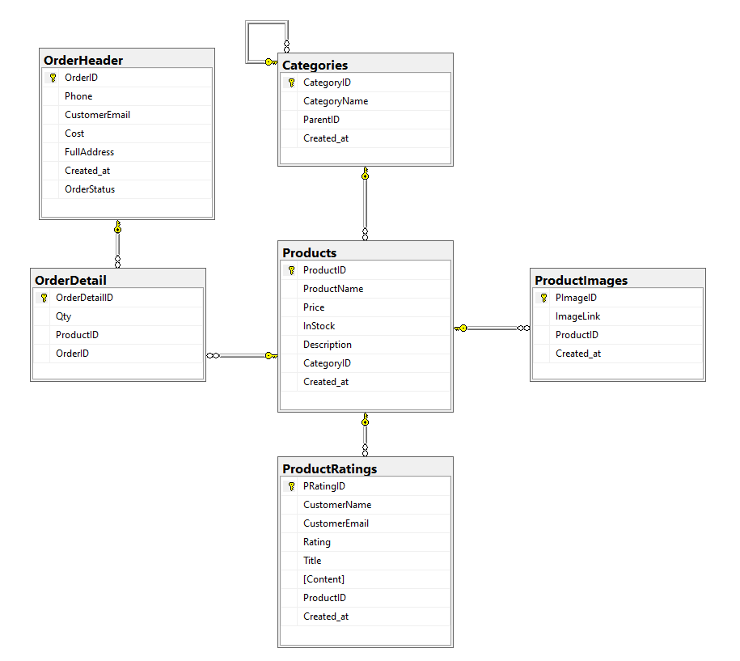

# TheFakeShop
TheFakeShop is a sample open source e-commerce website
## Azure Demo Link
[CustomerSite](https://customersite-fissama.azurewebsites.net) [Backend](https://backend-fissama.azurewebsites.net/swagger) [IdentityServer](https://identity-fissama.azurewebsites.net) [AdminSite](https://safissama.z23.web.core.windows.net)

## LogicArchitecture


## Features
#### Anonymous user
- View all products
- View products by category
- Search product by name
- View product detail + review
- Add product to cart
#### Signed-in user
- Rate & review product
- Create order from cart
- View orders history
- View detail order
#### Admin (Must authentication)
- Modify products
- Modify categories
- View users
## Get the code
Clone the repository:
```
git clone https://github.com/fissama/TheFakeShop.git
```
## Setup
1. First, you must run the script **CreateDatabaseScript.sql** in *./src/TheFakeShop.Script*
2. Secondly, open **Package Manager Console** and run a below code:
```
caffold-DbContext "Server=localhost;Database=TheFakeShop;Trusted_Connection=True;" Microsoft.EntityFrameworkCore.SqlServer -Force -OutputDir Models
```
## Build
From the command line:
```
cd TheFakeShop/src
dotnet restore
dotnet build
```
## Test
Before test, you must change ```.HasDefaultValueSql("(get_date())");``` to ```.HasDefaultValueSql("(CURRENT_TIMESTAMP)");``` in file TheFakeShopContext.cs of Backend/Models.Then, run the command line scripts to test:
```
cd TheFakeShop/src
dotnet test --no-build --verbosity normal
```
## Class&DatabaseDiagram
- Class diagram


- Database diagram


